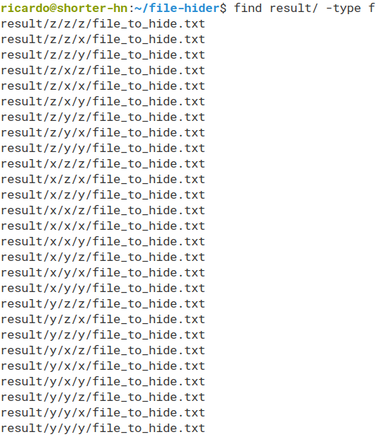

# total-hider

Hide your files in 'infinite' folders creating fake files in them.

## Usage

python hider.py FILE CHARACTERS

## Example

*python hider.py example.txt yzx*

It creates one folder for every character recursively, so the true file gets stored in the initial route and in the other folders a fake file (with the same name and size) gets stored.

And the real one is in ... y/z/x!